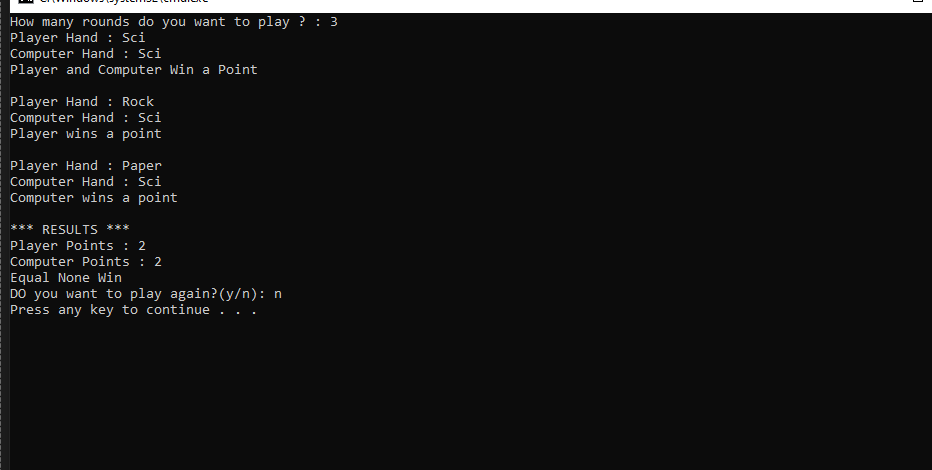

#Игра "Камень, Ножницы, Бумага"

Это простая игра "Камень, Ножницы, Бумага", реализованная на C#.
##Как играть

- Выберите один из трех вариантов: Камень, Бумага или Ножницы.
- Компьютер случайным образом выберет один из вариантов.
- Победитель определяется по стандартным правилам.

##Скриншоты

